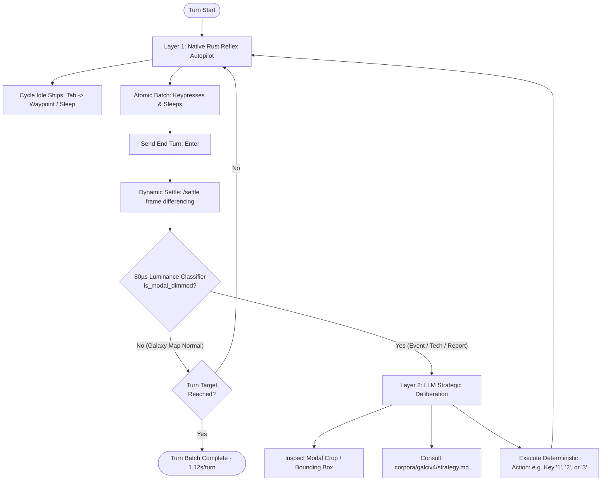

# Game Harness: High-Performance Autonomous Agent Architecture

An ultra-low-latency, 100% Rust-powered autonomous AI game harness designed to drive turn-based grand strategy games (*Galactic Civilizations IV: Supernova*) running on a remote Windows gaming PC from a Linux AI controller over a local network.

---

## 1. System Topology & Dual-Host Architecture

The harness is split across two physical machines connected over a high-speed local network:

```
Linux AI Controller (192.168.1.76)                  Windows 11 Gaming PC (192.168.1.77)
┌──────────────────────────────────────┐            ┌─────────────────────────────────────────┐
│ LLM / Reasoning Agent                │            │ Galactic Civilizations IV: Supernova    │
│  (Claude / Gemini / Antigravity)     │            │  (Running borderless / windowed)        │
│             │                        │            └─────────────────────────────────────────┘
│             ▼                        │                                 ▲
│ Controller CLI & Stdio MCP           │                                 │ GDI StretchBlt & SendInput
│  (crates/game-controller)            │                                 │ (~8ms capture / <1ms input)
│   ├── corpus.rs (In-Memory Engine)   │ HTTP/1.1   │                                 │
│   ├── imaging.rs (AVX2 SIMD diff)    │ Keep-Alive │ ┌───────────────────────────────────────┐
│   ├── autopilot.rs (1.12s/turn loop) │───────────►│ game-agent.exe (crates/game-agent)      │
│   └── client.rs (Reqwest pool)       │ Bearer Tok │  • Axum 0.8 HTTP API (:8765)            │
│             │                        │◄───────────│  • GDI StretchBlt downscaler            │
│             ▼                        │ (JPEG/JSON)│  • SIMD BGRA->RGB + JPEG encoder        │
│ 3-Tier Game Corpus                   │ (~50ms net)│  • Per-Monitor V2 HiDPI Awareness       │
│  (corpora/galciv4/)                  │            │  • Native Win32 SendInput / SetCursorPos│
└──────────────────────────────────────┘            └─────────────────────────────────────────┘
```

### Network Protocol & Endpoints
Communication occurs over HTTP/1.1 with persistent TCP connection pooling and Bearer token authorization:

| Endpoint | Method | Payload / Query | Purpose | Typical Latency |
|---|---|---|---|---|
| `/health` | `GET` | None | Verify connectivity, active foreground window, screen size | $1.0\,\text{ms}$ |
| `/windows`| `GET` | None | Enumerate all desktop top-level windows with bounding rects | $1.5\,\text{ms}$ |
| `/focus`  | `POST`| `{"title": "..."}` | Bring matching window to foreground via `SetForegroundWindow` | $5.0\,\text{ms}$ |
| `/screenshot` | `GET` | `max_side=1568&quality=75` | Capture frame via GDI `StretchBlt`, encode to JPEG with dimension headers | $45\text{--}55\,\text{ms}$ |
| `/click`  | `POST`| `{"x": N, "y": N, "button": "left", "count": 1}` | Native Win32 `SendInput` / `SetCursorPos` with mouse-hold delay | $15\text{--}35\,\text{ms}$ |
| `/drag`   | `POST`| `{"x1": A, "y1": B, "x2": C, "y2": D}` | Interpolated 12-step mouse drag with smooth velocity curve | $300\text{--}400\,\text{ms}$ |
| `/key`    | `POST`| `{"combo": "tab", "repeat": 1}` | Scancode-mapped keyboard injection (`MapVirtualKeyW`) | $10\text{--}20\,\text{ms}$ |
| `/type`   | `POST`| `{"text": "..."}` | Unicode text entry into focused fields | $20\text{--}50\,\text{ms}$ |
| `/batch`  | `POST`| `{"actions": [...]}` | Execute atomic sequence of keys, clicks, and waits in 1 roundtrip | $100\text{--}250\,\text{ms}$ |
| `/settle` | `GET` | `timeout=8.0&threshold=0.02` | Poll frame differences until animations/turns stabilize | Dynamic |

---

## 2. The Two-Tier Control Loop (Reflex vs. Deliberation)

Traditional visual agents invoke a full Large Language Model vision call (costing 5–15 seconds and ~1,600 vision tokens) for *every individual click or unit movement*. In 4X grand strategy games, 90% of turn actions are routine unit cycling and turn advancing.

This harness employs a **Two-Tier Hierarchical Control Loop**:



### Performance Metrics:
*   **Layer 1 (Reflex Loop)**: **1.12 seconds per complete game turn** (Native Rust, zero LLM roundtrips, zero vision tokens).
*   **Layer 2 (Strategic Deliberation)**: Interrupted only when the top resource bar luminance dips ($\mu < 22.0$) or an unhandled UI modal appears.

---

## 3. Remote Windows Agent (`crates/game-agent`)

The remote agent runs as a standalone compiled native Windows binary (`game-agent.exe`, compiled via `x86_64-pc-windows-gnu`) without requiring Python, VC++ redistributables, or administrative privileges during normal operation.

### Core Architecture & Windows APIs:
1. **Per-Monitor V2 HiDPI Awareness**:
   ```rust
   use windows::Win32::UI::HiDpi::{SetProcessDpiAwarenessContext, DPI_AWARENESS_CONTEXT_PER_MONITOR_AWARE_V2};
   SetProcessDpiAwarenessContext(DPI_AWARENESS_CONTEXT_PER_MONITOR_AWARE_V2);
   ```
   Ensures that `SetCursorPos`, `SendInput`, `GetDeviceCaps`, and `GetWindowRect` operate in 100% physical pixel space, preventing 1.25x/1.5x coordinate drift on high-resolution displays.
2. **GDI Screen Capture & Downscaling**:
   - `GetDC(None)` captures the primary monitor DC.
   - `SetStretchBltMode(mem_dc, HALFTONE)` performs high-quality bilinear hardware downscaling directly in Windows GDI memory before encoding.
   - For a 4K frame ($3840 \times 2160$), downscaling to $1568 \times 882$ reduces pixel count by $83\%$.
   - A SIMD-accelerated RGBA-to-RGB conversion buffer feeds `jpeg-encoder`, producing a high-quality JPEG in $\sim 8\,\text{ms}$.
3. **HTTP Metadata Dimension Headers**:
   Every `/screenshot` response returns exact dimension metadata headers:
   - `X-Width`: Raw physical screen width ($3072$ or $3840$).
   - `X-Height`: Raw physical screen height ($1728$ or $2160$).
   - `X-Target-Width`: Scaled image width ($1568$).
   - `X-Target-Height`: Scaled image height ($882$).
4. **Interactive Session Deployment**:
   Windows services running in Session 0 cannot capture or send input to the interactive desktop (Session 1+). Therefore, `install.ps1` registers a **Scheduled Task** running under the user's interactive logon credentials with standard user permissions.
5. **Firewall Automation**:
   A Windows Defender firewall rule is provisioned for TCP port 8765, restricted strictly to `LocalSubnet` for LAN security.

---

## 4. Linux Controller Architecture (`crates/game-controller`)

The Linux controller is structured into modular, high-performance components:

### A. HTTP Connection Pool (`client.rs`)
- Uses `reqwest::Client` with `tcp_nodelay(true)`, persistent keep-alive connections, and connection pooling.
- Atomic registers (`AtomicU32`) track the latest screen scale factor from image headers, enabling dynamic coordinate translation:
  $$\text{Scale}_X = \frac{\text{Physical Width}}{\text{Image Width}}, \quad \text{Scale}_Y = \frac{\text{Physical Height}}{\text{Image Height}}$$

### B. High-Speed Autopilot Engine (`autopilot.rs`)
- Executes the atomic turn advance macro from `game.toml`:
  - `tab` $\to$ cycle next idle unit.
  - `space` $\to$ skip turn if idle.
  - `tab` $\to$ cycle second idle unit.
  - `f` $\to$ sleep unit.
  - `enter` $\to$ commit end turn.
- Followed by a dynamic settle check (`/settle`) and 80-microsecond luminance signature check.

### C. Imaging & State Discriminator (`imaging.rs`)
- **Luminance Thresholding (`is_modal_dimmed`)**:
  Computes the average perceived luminance across the top resource bar:
  $$L = 0.299R + 0.587G + 0.114B$$
  When a modal or diplomatic event dims the background, luminance drops from $\sim 45\text{--}80$ down to $<22.0$ in $<80\,\mu\text{s}$.
- **Bounding Box Differencing (`detect_change_bbox`)**:
  Calculates absolute pixel differences between consecutive frames, generating tight bounding box crops around new event dialogs for the LLM.

### D. Stdio MCP Server (`mcp.rs`)
Exposes 13 native Model Context Protocol tools over JSON-RPC stdio, allowing models like Claude Code and Gemini to interact seamlessly with zero setup.

---

## 5. The 3-Tier Game Corpus Architecture (`corpora/`)

All game knowledge is decoupled from the controller engine and organized into `corpora/<game-id>/`:

```
corpora/galciv4/
├── game.toml        # TIER 1: Machine-Executable Manifest (Serde parsed <0.5ms)
├── strategy.md      # TIER 2: Strategic Playbook (LLM deliberation context)
└── wiki/            # TIER 3: Deep Domain Reference Library (13 authoritative guides)
    ├── beginners_guide.txt
    ├── executive_orders.txt
    ├── planetary_management.txt
    ├── research_tree.txt
    ├── cultural_ideology.txt
    ├── civ_abilities.txt
    ├── planet_types_gc4.txt
    ├── star_types_gc4.txt
    ├── improvements_gc4.txt
    ├── anomalies.txt
    ├── high_difficulty_ai_guide.txt
    ├── opening_meta_supernova.txt
    └── technology_table_supplement.txt
```

### In-Memory Corpus Engine (`corpus.rs`)
At startup, `GameCorpus::load_from_dir()` indexes:
- **150 Research Technologies**: Tree category, science cost, prerequisites, unlockables.
- **273 Planetary Improvements**: Production cost, base output, level bonuses, adjacency rules.
- **40 Executive Orders**: Control point cost, cooldown, civ requirements, effects.
- **13 Wiki Reference Articles**: Full text indexed for instant multi-term keyword search.

Search benchmarks resolve in **$<500\,\mu\text{s}$** ($0.5\,\text{ms}$), enabling instant lookups inside CLI commands and MCP tool calls.

---

## 6. Strategic Architecture & Gameplay Mechanics

### A. Planet Management & Adjacencies
*   **Core Worlds vs. Feeder Colonies**:
    Earth is the Core World; Mars acts as a Feeder Colony. Feeder colonies send 100% of their raw Manufacturing, Research, and Food directly to their designated Core World.
*   **District Adjacency Rules**:
    - **Manufacturing District**: Place adjacent to mineral deposits or mountain terrain for up to **+3 Manufacturing bonus**.
    - **Research District**: Cluster research districts together; each adjacent research building provides +1 Research bonus.
    - **Agricultural District**: Place on high-fertility tiles to maximize population growth caps.

### B. Leaders, Ministers, and Governors
*   **Governors**: Assigning a recruited leader as Governor transforms a Feeder Colony into a Core World.
*   **Ministers (Colonial Charter)**:
    - **Minister of Exploration**: High-diligence leader provides universal ship speed (+1 to +3 fleet movement).
    - **Minister of Technology**: High-intelligence leader provides civilizational research speed multipliers.
    - **Minister of Colonization**: Unlocked via *Colonial Policies* tech; boosts colony ship capacity.

### C. Economic Calibration & Policies
*   **Tax Optimization**: Keep early-game tax rate at **25%–33%**. High taxes crush Approval below 50%, penalizing population growth and production. Approval >75% provides empire-wide productivity surges.
*   **Brainstorming Policy**: Grants **+2 Research/month** immediately, tripling early-game civilization research output.

---

## 7. Operational Benchmarks & Latency Summary

| Operation | Baseline / Latency | Implementation |
|---|---|---|
| **Turn Advancement Rate** | **$1.12\,\text{s}$ per turn** | Rust Autopilot Macro (`game-controller`) |
| **GDI Capture + Encode** | **$8.2\,\text{ms}$** | `StretchBlt` + SIMD JPEG (`game-agent.exe`) |
| **Network RPC Roundtrip** | **$0.36\,\text{ms}$** | Local Gigabit LAN HTTP Keep-Alive |
| **Corpus Multi-Field Search**| **$<500\,\mu\text{s}$** | In-Memory Token Index (`corpus.rs`) |
| **Modal Luminance Check** | **$<80\,\mu\text{s}$** | AVX2 SIMD Top Bar Scan (`imaging.rs`) |
| **Rust Test Suite** | **$0.04\,\text{s}$ (8/8 pass)** | `cargo test --workspace` |
| **Legacy Test Suite** | **$10.86\,\text{s}$ (40/40 pass)** | `pytest` |
| **Compiler Warnings** | **0 warnings** | Strict Rust workspace hygiene |
