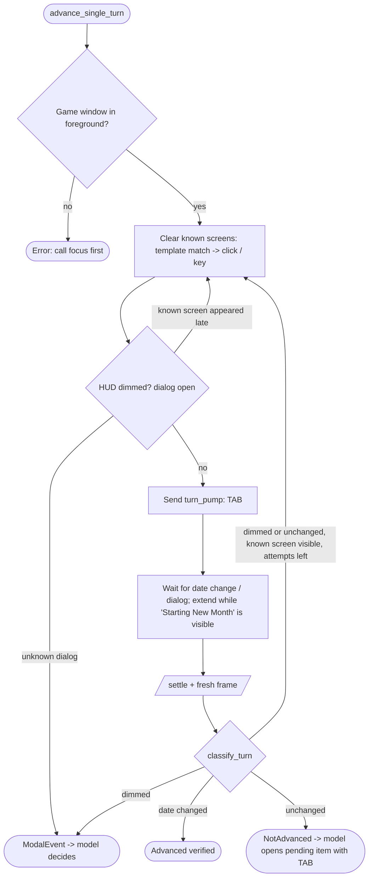

# Game Harness: High-Performance Autonomous Agent Architecture

An ultra-low-latency, 100% Rust-powered autonomous AI game harness designed to drive turn-based grand strategy games (*Galactic Civilizations IV: Supernova*) running on a remote Windows gaming PC from a Linux AI controller over a local network.

---

## 1. System Topology & Dual-Host Architecture

The harness is split across two physical machines connected over a high-speed local network:

```
Linux AI Controller (192.168.1.76)                  Windows 11 Gaming PC (192.168.1.77)
┌──────────────────────────────────────┐            ┌─────────────────────────────────────────┐
│ LLM / Reasoning Agent                │            │ Galactic Civilizations IV: Supernova    │
│  (Claude / Gemini / Antigravity)     │            │  (Running borderless / windowed)        │
│             │                        │            └─────────────────────────────────────────┘
│             ▼                        │                                 ▲
│ Controller CLI & Stdio MCP           │                                 │ GDI StretchBlt & SendInput
│  (crates/game-controller)            │                                 │ (~8ms capture / <1ms input)
│   ├── corpus.rs (records + chunks)   │ HTTP/1.1   │                                 │
│   ├── imaging.rs (diff + luminance)  │ Keep-Alive │ ┌───────────────────────────────────────┐
│   ├── autopilot.rs (verified turns)  │───────────►│ game-agent.exe (crates/game-agent)      │
│   └── client.rs (Reqwest pool)       │ Bearer Tok │  • Axum 0.8 HTTP API (:8765)            │
│             │                        │◄───────────│  • GDI StretchBlt downscaler            │
│             ▼                        │ (JPEG/JSON)│  • BGRA->RGB + JPEG encoder             │
│ Game Corpus (manifest/data/docs)     │ (~50ms net)│  • Per-Monitor V2 HiDPI Awareness       │
│  (corpora/galciv4/)                  │            │  • Native Win32 SendInput / SetCursorPos│
└──────────────────────────────────────┘            └─────────────────────────────────────────┘
```

### Network Protocol & Endpoints
Communication occurs over HTTP/1.1 with persistent TCP connection pooling and Bearer token authorization. Coordinates sent to the agent are **screen pixels**; the controller converts from 1568×882 image space. `/drag` timing fields and the `/batch` actions `mouse_down`/`mouse_up` exist from agent **1.1.0** (built, not yet deployed; the PC runs 1.0.0, which ignores the timing fields and rejects those batch actions).

| Endpoint | Method | Payload / Query | Purpose | Typical Latency |
|---|---|---|---|---|
| `/health` | `GET` | None | Verify connectivity, active foreground window, screen size | $1.0\,\text{ms}$ |
| `/windows`| `GET` | None | Enumerate all desktop top-level windows with bounding rects | $1.5\,\text{ms}$ |
| `/focus`  | `POST`| `{"title": "..."}` | Bring matching window to foreground via `SetForegroundWindow` | $5.0\,\text{ms}$ |
| `/screenshot` | `GET` | `max_side=1568&quality=75` | Capture frame via GDI `StretchBlt`, encode to JPEG with dimension headers | $45\text{--}55\,\text{ms}$ |
| `/click`  | `POST`| `{"x": N, "y": N, "button": "left", "count": 1}` | Native Win32 `SendInput` / `SetCursorPos` with mouse-hold delay | $15\text{--}35\,\text{ms}$ |
| `/drag`   | `POST`| `{"x1": A, "y1": B, "x2": C, "y2": D, "button": "left", "hold_ms": 30, "steps": 12, "step_ms": 15, "dwell_ms": 30, "wiggle": false}` | Press, hold `hold_ms`, move in `steps` (2..120) interpolated moves `step_ms` (5..200) apart, optionally wiggle ±3 px at the target, dwell `dwell_ms` (0..3000), release. All timing fields optional; the response echoes the clamped values | $300\text{--}400\,\text{ms}$ at defaults |
| `/move`   | `POST`| `{"x": N, "y": N}` | Move the cursor (hover for tooltips) | $5\,\text{ms}$ |
| `/scroll` | `POST`| `{"x": N, "y": N, "clicks": N}` | Mouse wheel at a point (map zoom) | $10\,\text{ms}$ |
| `/key`    | `POST`| `{"combo": "tab", "repeat": 1}` | Scancode-mapped keyboard injection (`MapVirtualKeyW`) | $10\text{--}20\,\text{ms}$ |
| `/type`   | `POST`| `{"text": "..."}` | Unicode text entry into focused fields | $20\text{--}50\,\text{ms}$ |
| `/batch`  | `POST`| `{"actions": [...]}` | Execute a validated sequence (max 100) of `move`, `click`, `mouse_down`/`mouse_up` (`button`: left/right/middle), `key`, `type`, `wait` in 1 roundtrip; any invalid step rejects the whole batch. `mouse_down` + `move` + `wait` + `mouse_up` scripts arbitrary drags | $100\text{--}250\,\text{ms}$ |
| `/settle` | `GET` | `timeout=8.0&threshold=0.02` | Poll frame differences until animations/turns stabilize | Dynamic |

---

## 2. The Two-Tier Control Loop (Reflex vs. Deliberation)

A model vision call costs seconds and ~1,600 tokens; most turns in a 4X game need no decision. The harness splits the work:

- **Layer 1 — autopilot (Rust, no model):** ends turns, verifies each one, and clears *known screens* whose answer is always the same (news bulletins, colonize confirmations, idle colony/survey ships, boarding, empty shipyard, diplomacy menus).
- **Layer 2 — the model:** only sees the frame when a turn is blocked by something that needs judgement (events, research, builds, policies, leaders, trades), decides using the corpus and `strategy.md`, acts, and hands control back.



### How a turn is judged (`autopilot.rs`)
Every `advance_single_turn` call:
1. **Refuses** unless the agent reports the game as the foreground window (the macro is blind keystrokes).
2. **Clears known screens** (§4B) until none match, letting the screen settle after each action (an action can open a follow-up dialog after a camera pan). If a dialog is open and it is *not* a known screen, returns `ModalEvent` without sending any key.
3. Sends the manifest's `turn_pump` macro — a single **TAB**, which ends the turn, or opens the next pending item when something blocks it.
4. **Waits for a turn signal**: polls until the `turn_indicator_roi` (the date readout) changes or the HUD dims, up to the macro's `settle_timeout`, extended (to at most 180 s) while a `busy` screen such as "Starting New Month" is visible. Then `/settle` and a fresh frame.
5. **Classifies** with `classify_turn` (pure, unit-tested): HUD dimmed → `ModalEvent`; date changed → `Advanced { verified: true }`; unchanged → `NotAdvanced`. The date comparison uses the **largest per-glyph difference** (`region_diff_max_strip`, 6-px column strips) because a month change can alter only one or two characters (the whole-box mean missed "Jul → Aug").
6. **Retries** (up to 3 attempts per turn) when the verdict is not `Advanced` and a known screen is visible — e.g. TAB selected an idle colony ship, whose Auto Colonize then raises "Colonize Planet?".

Outcomes report which known screens were dismissed. Loops (`autopilot`, `autopilot_turns`) stop at the first `ModalEvent` or `NotAdvanced` and hand the model the frame. A turn usually takes 2–3 s plus AI processing; turns with dismissals 5–13 s.

---

## 3. Remote Windows Agent (`crates/game-agent`)

The remote agent runs as a standalone compiled native Windows binary (`game-agent.exe`, compiled via `x86_64-pc-windows-gnu`) without requiring Python, VC++ redistributables, or administrative privileges during normal operation.

### Core Architecture & Windows APIs:
1. **Per-Monitor V2 HiDPI Awareness**:
   ```rust
   use windows::Win32::UI::HiDpi::{SetProcessDpiAwarenessContext, DPI_AWARENESS_CONTEXT_PER_MONITOR_AWARE_V2};
   SetProcessDpiAwarenessContext(DPI_AWARENESS_CONTEXT_PER_MONITOR_AWARE_V2);
   ```
   Ensures that `SetCursorPos`, `SendInput`, `GetDeviceCaps`, and `GetWindowRect` operate in 100% physical pixel space, preventing 1.25x/1.5x coordinate drift on high-resolution displays.
2. **GDI Screen Capture & Downscaling**:
   - `GetDC(None)` captures the primary monitor DC.
   - `SetStretchBltMode(mem_dc, HALFTONE)` performs high-quality bilinear hardware downscaling directly in Windows GDI memory before encoding.
   - For a 4K frame ($3840 \times 2160$), downscaling to $1568 \times 882$ reduces pixel count by $83\%$.
   - The BGRA buffer is converted to RGB and fed to `jpeg-encoder`; capture plus encode measures about 8 ms.
3. **HTTP Metadata Dimension Headers**:
   Every `/screenshot` response returns exact dimension metadata headers:
   - `X-Width`: Raw physical screen width ($3072$ or $3840$).
   - `X-Height`: Raw physical screen height ($1728$ or $2160$).
   - `X-Target-Width`: Scaled image width ($1568$).
   - `X-Target-Height`: Scaled image height ($882$).
4. **Interactive Session Deployment**:
   Windows services running in Session 0 cannot capture or send input to the interactive desktop (Session 1+). Therefore, `install.ps1` registers a **Scheduled Task** running under the user's interactive logon credentials with standard user permissions.
5. **Firewall Automation**:
   A Windows Defender firewall rule is provisioned for TCP port 8765, restricted strictly to `LocalSubnet` for LAN security.

---

## 4. Linux Controller Architecture (`crates/game-controller`)

The Linux controller is structured into modular, high-performance components:

### A. HTTP Connection Pool (`client.rs`)
- Uses `reqwest::Client` with `tcp_nodelay(true)`, persistent keep-alive connections, and connection pooling.
- Atomic registers (`AtomicU32`) track the latest screen scale factor from image headers, enabling dynamic coordinate translation:
  $$\text{Scale}_X = \frac{\text{Physical Width}}{\text{Image Width}}, \quad \text{Scale}_Y = \frac{\text{Physical Height}}{\text{Image Height}}$$

### B. Autopilot and known screens (`autopilot.rs`)
The turn procedure is in §2. Known screens are declared in `corpora/galciv4/manifest.toml`:

```toml
[screens.colonize_confirm]
description = "..."                         # why the action is always right
template = "templates/colonize_planet_title.png"
template_roi = [0.4401, 0.3379, 0.1212, 0.0295]   # normalized [x, y, w, h] in the frame
template_threshold = 0.06                   # max mean abs difference, 0..1 (default 0.08)
auto_dismiss = true
dismiss_click = [0.5708, 0.5952]            # or dismiss_key = "c", or dismiss_clicks = [[x,y], ...]
only_when_blocked = false                   # true: act only after TAB failed to end the turn
busy = false                                # true: game still processing -> keep waiting, never act
```

| Field | Effect |
|---|---|
| `template`, `template_roi`, `template_threshold` | Recognition: `imaging::template_diff` over the ROI must be ≤ the threshold. |
| `auto_dismiss` | The autopilot may act on the screen by itself. |
| `dismiss_clicks` / `dismiss_click` / `dismiss_key` | The action, in that order of precedence; clicks are normalized and executed in sequence with a 600 ms pause. |
| `only_when_blocked` | For "selected idle unit" screens: a unit that merely stays selected may already be busy, and re-ordering it can cancel work (e.g. abandon a survey). Acted on only on a retry, i.e. right after TAB selected it. |
| `busy` | Recognised but never acted on; while visible the turn wait is extended (cap `BUSY_MAX_WAIT_SECS` = 180). |

Each screen is handled at most once per attempt; at most 4 dismissals per turn. Templates are loaded at startup relative to the manifest's directory; a test requires every declared template to load. Current screens: `gnn_news`, `diplomacy_menu`, `colonize_confirm`, `colony_ship_boarding`, `idle_colony_ship`, `idle_survey_ship`, `survey_abandon_confirm`, `shipyard_idle`, `turn_processing` (busy). How to add one: `AGENTS.md` §5.

### C. Imaging (`imaging.rs`)
- `region_mean_luminance` — HUD dim detection over `luminance_roi` (threshold 22; the lit top bar is ~45–80).
- `region_diff_max_strip` — per-glyph change detector for the date readout; real-frame fixtures in `crates/game-controller/tests/fixtures/` (same date ≤ 0.003, one changed month ≈ 0.10).
- `template_diff` — known-screen recognition (real GNN logo matches at < 0.03; the same region of the map is > 0.15).
- `roi_from_norm`, `clamp_roi` — normalized manifest coordinates → pixels.
- `detect_change_bbox` — crop of the changed region handed to the model with a `ModalEvent`.

### D. Stdio MCP Server (`mcp.rs`)
Exposes 19 Model Context Protocol tools over JSON-RPC stdio: screen and input tools, autopilot, and the corpus tools (`corpus_search`, `corpus_get`, `corpus_tech`, `corpus_improvement`, `corpus_order`, `corpus_info`, `corpus_strategy`).

---

## 5. Game Corpus (`corpora/<game>/`)

All game knowledge lives under `corpora/<game>/`; the controller loads whatever is present and knows nothing game-specific. Sources of truth are multiple files because they differ in provenance and change cadence; the runtime compiles them into one in-memory index at startup (about 1 ms for ~250 KB).

```
corpora/galciv4/
├── manifest.toml    # hotkeys (34), screens (17; 9 with templates), macros (3) — hand-verified (game.toml still accepted)
├── templates/*.png  # reference crops for known screens, captured from live 1568x882 frames
├── strategy.md      # playbook for the model; also chunked for search
├── data/            # GENERATED records, one JSON array per kind (tech, improvement, order, event, …)
│   └── README.md    # record contract; _meta.json records game version + generator
└── docs/*.md        # reference prose with Source:/License: headers (13 files today)
```

### Records (`data/*.json`)
Generic records — `id`, `name`, `aliases`, `summary`, `fields` — so the extractor decides which fields each kind carries. `scripts/extract-galciv4.py` generates them from the game's own definition files (`<install>/Data/Gameplay/*.xml`, display strings from the 38k `StringTable` labels in `Data/English/Text/*.xml`), never from the wiki. Current output for game version 4.1.1: 130 techs (Terran `HumanTechTree`; `--tech-tree` selects another), 528 improvements, 66 executive orders, 203 policies, 355 ship components, 167 starbase modules and 994 events (2,443 records).

- Techs: research cost, age, prerequisites resolved to display names, typed effects, and an `unlocks` list built by reverse lookup over improvements, ship components, policies, starbase modules, executive orders, hulls, abilities, leaders and invasion tactics.
- Improvements: build/maintenance/resource costs separated from effects, per-level effects, adjacency bonuses, tech and trait requirements, source file.
- Executive orders: name, description, modifiers (with duration) and actions resolved through their `ArtifactPowerDef`; control/credit cost, cooldown, tech requirements, blocking traits.
- Policies: type (Accord, Investment, Decree, …), alignment, consensus/authority/collateral cost, maturity turns, upkeep, effects, the executive order an investment grants, and tech/government/policy/trait prerequisites (`PolicyDefs*.xml`).
- Ship components: category, type, slot, one-per-ship/civilization limit, manufacturing cost, mass (`5 + 2% of hull` for hull-scaled parts), strategic resources, effects, per-level effects, tech/trait requirements (`ShipComponentDefs*.xml`, `ShipComponents_*.xml`). AI hints (`Threat`, `Value`, battle-rating mods) are dropped and `Hidden` hull-class markers skipped.
- Starbase modules: specialization, module-slot cost, credit/resource costs, maintenance, effects, the module it upgrades from, required and excluded modules, star type, build turns, limits and DLC (`StarbaseModuleDefs*.xml`, `starbasemoduledefs*.xml`).
- Events: every event dialog (`Events/*.xml`, `HomeworldEvents*.xml`, `ColonizeEvents*.xml`; developer `Test*.xml` skipped) with its type, once-per-player flag and a `choices` list — `N. <button text> [<bonus text>] -> <outcomes>`, each outcome marked one-time, permanent or `for N turns`, action parameters resolved to display names — so the model can answer an event dialog without guessing.
- Effects render through `StatTypeDisplayDefs` (`+20% Manufacturing (Colony)`, percentages honoured, target qualifiers such as `capital world only` kept); UI markup such as `[ICON=…]` is stripped and script bookkeeping (flags, counters, stored event targets) left out.
- Display-name collisions are resolved deliberately: tutorial variants lose, `_Human`/`_Terran` variants beat the base definition, other factions' variants lose, and genuine tiers (`Project_UpgradeWealth1/2/3`, `DysonSphereBaseModule_Red/_Blue`) are kept under suffixed ids (tier number, else the distinguishing part of the internal name) with a `variant` field. Events are never ranked away: exact duplicates merge and every distinct outcome set is kept.

The loader rejects nameless records and duplicate ids at startup, so a bad extract fails the build rather than a game turn. The raw XML is not committed (Stardock's data); `data/_meta.json` records the game version and generator commit for reproducibility.

### Chunks (`docs/*.md`, `strategy.md`)
Each doc's header (title, `Source:`, `License:`) is stripped; the body is grouped into paragraph chunks of at most 1,500 characters with ids like `doc:planetary_management#3` and `strategy#1`. 13 docs → 168 chunks today.

### Lookup and search (`corpus.rs`)
- `lookup(kind, name)`: normalized name or alias, else the closest trigram match (Dice ≥ 0.6) of that kind.
- `search(query, limit)`: records score on name/alias/field matches; chunks must contain every query token and score on exact phrase, title, and occurrence count. Ties break on id, so results are deterministic. Returns ids and ~120-character match snippets only; bodies come from `get(id)`. Measured 0.4–0.8 ms over 724 records and 168 chunks, ~1.6 ms over 2,443 records (text is normalized once at load).
- `get(id)`: one compact record (heading plus one line per field) or one chunk.

A record whose name matches the query scores 100, above any prose chunk, so `draft colonists` returns `order:draft_colonists` first and the wiki mentions after it.

## 6. Strategic Architecture & Gameplay Mechanics

### A. Planet Management & Adjacencies
*   **Core Worlds vs. Feeder Colonies**:
    Earth is the Core World; Mars acts as a Feeder Colony. Feeder colonies send 100% of their raw Manufacturing, Research, and Food directly to their designated Core World.
*   **District Adjacency Rules**:
    - **Manufacturing District**: Place adjacent to mineral deposits or mountain terrain for up to **+3 Manufacturing bonus**.
    - **Research District**: Cluster research districts together; each adjacent research building provides +1 Research bonus.
    - **Agricultural District**: Place on high-fertility tiles to maximize population growth caps.

### B. Leaders, Ministers, and Governors
*   **Governors**: Assigning a recruited leader as Governor transforms a Feeder Colony into a Core World.
*   **Ministers (Colonial Charter)**:
    - **Minister of Exploration**: High-diligence leader provides universal ship speed (+1 to +3 fleet movement).
    - **Minister of Technology**: High-intelligence leader provides civilizational research speed multipliers.
    - **Minister of Colonization**: Unlocked via *Colonial Policies* tech; boosts colony ship capacity.

### C. Economic Calibration & Policies
*   **Tax Optimization**: Keep early-game tax rate at **25%–33%**. High taxes crush Approval below 50%, penalizing population growth and production. Approval >75% provides empire-wide productivity surges.
*   **Brainstorming Policy**: Grants **+2 Research/month** immediately, tripling early-game civilization research output.

---

## 7. Operational Benchmarks & Latency Summary

| Operation | Baseline / Latency | Implementation |
|---|---|---|
| **Turn Advancement** | game-bound (end-turn processing + settle); each turn verified | `autopilot.rs` `classify_turn` |
| **GDI Capture + Encode** | ~8 ms | `StretchBlt` + `jpeg-encoder` (`game-agent.exe`) |
| **Network RPC Roundtrip** | **$0.36\,\text{ms}$** | Local Gigabit LAN HTTP Keep-Alive |
| **Corpus Search** | 0.4–0.8 ms measured (724 records, 168 chunks) | Linear scan over text normalized at load (`corpus.rs`) |
| **Modal Luminance Check** | sub-millisecond | Mean luminance over the manifest's `luminance_roi` (`imaging.rs`); no SIMD intrinsics |
| **Rust Test Suite** | 41 tests (31 controller, 10 agent) | `cargo test --workspace` |
| **Python tests** | 55 (extractor fixtures, CLI offline check, legacy harness) | `pytest` |
| **Lint** | clippy clean with `-D warnings` except `wrong_self_convention` (`imaging.rs`); `#![allow(dead_code, …)]` still present in `game-agent/main.rs`, `imaging.rs`, `mcp.rs` | `scripts/ci.sh` |
