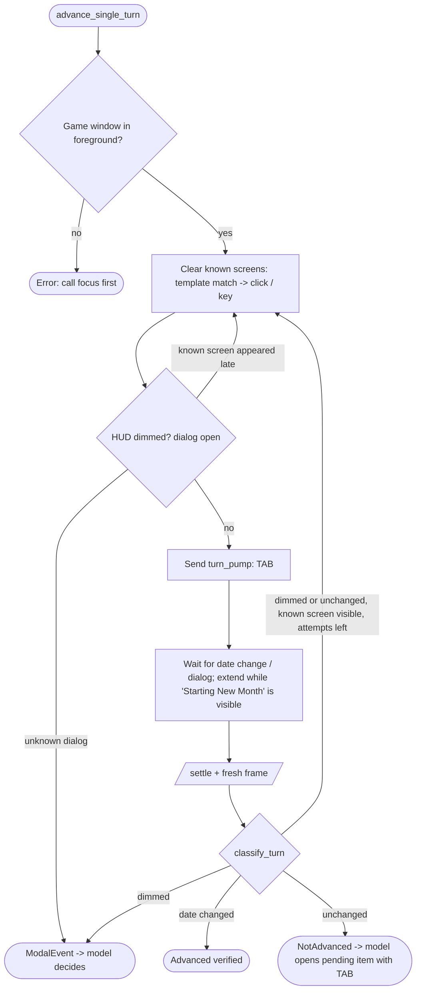

# Game Harness: High-Performance Autonomous Agent Architecture

An ultra-low-latency, 100% Rust-powered autonomous AI game harness designed to drive turn-based grand strategy games (*Galactic Civilizations IV: Supernova*) running on a remote Windows gaming PC from a Linux AI controller over a local network.

---

## 1. System Topology & Dual-Host Architecture

The harness is split across two physical machines connected over a high-speed local network:

```
Linux AI Controller                                 Windows 11 Gaming PC       
┌──────────────────────────────────────┐            ┌─────────────────────────────────────────┐
│ LLM / Reasoning Agent                │            │ Galactic Civilizations IV: Supernova    │
│  (Claude / Gemini / Antigravity)     │            │  (Running borderless / windowed)        │
│             │                        │            └─────────────────────────────────────────┘
│             ▼                        │                                 ▲
│ Controller CLI & Stdio MCP           │                                 │ GDI StretchBlt & SendInput
│  (crates/game-controller)            │                                 │ (~8ms capture / <1ms input)
│   ├── corpus.rs (records + chunks)   │ HTTP/1.1   │                                 │
│   ├── imaging.rs (diff + luminance)  │ Keep-Alive │ ┌───────────────────────────────────────┐
│   ├── autopilot.rs (verified turns)  │───────────►│ game-agent.exe (crates/game-agent)      │
│   └── client.rs (Reqwest pool)       │ Bearer Tok │  • Axum 0.8 HTTP API (:8765)            │
│             │                        │◄───────────│  • GDI StretchBlt downscaler            │
│             ▼                        │ (JPEG/JSON)│  • BGRA->RGB + JPEG encoder             │
│ Game Corpus (manifest/data/docs)     │ (~50ms net)│  • Per-Monitor V2 HiDPI Awareness       │
│  (corpora/galciv4/)                  │            │  • Native Win32 SendInput / SetCursorPos│
└──────────────────────────────────────┘            └─────────────────────────────────────────┘
```

### Network Protocol & Endpoints
Communication occurs over HTTP/1.1 with persistent TCP connection pooling and Bearer token authorization. Coordinates sent to the agent are **screen pixels**; the controller converts from 1568×882 image space. `/drag` timing fields and the `/batch` actions `mouse_down`/`mouse_up` exist from agent **1.1.0** (built, not yet deployed; the PC runs 1.0.0, which ignores the timing fields and rejects those batch actions).

| Endpoint | Method | Payload / Query | Purpose | Typical Latency |
|---|---|---|---|---|
| `/health` | `GET` | None | Verify connectivity, active foreground window, screen size | $1.0\,\text{ms}$ |
| `/windows`| `GET` | None | Enumerate all desktop top-level windows with bounding rects | $1.5\,\text{ms}$ |
| `/focus`  | `POST`| `{"title": "..."}` | Bring matching window to foreground via `SetForegroundWindow` | $5.0\,\text{ms}$ |
| `/screenshot` | `GET` | `max_side=1568&quality=75` | Capture frame via GDI `StretchBlt`, encode to JPEG with dimension headers | $45\text{--}55\,\text{ms}$ |
| `/click`  | `POST`| `{"x": N, "y": N, "button": "left", "count": 1}` | Native Win32 `SendInput` / `SetCursorPos` with mouse-hold delay | $15\text{--}35\,\text{ms}$ |
| `/drag`   | `POST`| `{"x1": A, "y1": B, "x2": C, "y2": D, "button": "left", "hold_ms": 30, "steps": 12, "step_ms": 15, "dwell_ms": 30, "wiggle": false}` | Press, hold `hold_ms`, move in `steps` (2..120) interpolated moves `step_ms` (5..200) apart, optionally wiggle ±3 px at the target, dwell `dwell_ms` (0..3000), release. All timing fields optional; the response echoes the clamped values | $300\text{--}400\,\text{ms}$ at defaults |
| `/move`   | `POST`| `{"x": N, "y": N}` | Move the cursor (hover for tooltips) | $5\,\text{ms}$ |
| `/scroll` | `POST`| `{"x": N, "y": N, "clicks": N}` | Mouse wheel at a point (map zoom) | $10\,\text{ms}$ |
| `/key`    | `POST`| `{"combo": "tab", "repeat": 1}` | Scancode-mapped keyboard injection (`MapVirtualKeyW`) | $10\text{--}20\,\text{ms}$ |
| `/type`   | `POST`| `{"text": "..."}` | Unicode text entry into focused fields | $20\text{--}50\,\text{ms}$ |
| `/batch`  | `POST`| `{"actions": [...]}` | Execute a validated sequence (max 100) of `move`, `click`, `mouse_down`/`mouse_up` (`button`: left/right/middle), `key`, `type`, `wait` in 1 roundtrip; any invalid step rejects the whole batch. `mouse_down` + `move` + `wait` + `mouse_up` scripts arbitrary drags | $100\text{--}250\,\text{ms}$ |
| `/settle` | `GET` | `timeout=8.0&threshold=0.02` | Poll frame differences until animations/turns stabilize | Dynamic |
| `/files/roots` | `GET` | None | Named read-only roots from `roots.json` (written by the installer: Stellaris / GalCiv4 documents and install folders) and whether they exist | ms |
| `/files/list` | `GET` | `root=stellaris_docs&path=save games` | Directory listing: name, is_dir, size, modified (Unix s) | ms |
| `/files/read` | `GET` | `root=…&path=logs/game.log&offset=N&max=M` | File bytes from `offset` (≤16 MiB per response since 1.5.0; the controller pages larger files), headers `X-File-Size`, `X-Offset` — follow a growing log by re-reading from the last size. Relative paths only; `..`, absolute paths, drive/stream/UNC syntax, Windows device names, names ending in a dot or space, and symlinks leaving the root are refused. No write/delete/execute. Agent ≥ 1.2.0 | size-bound |
| `/tuner/states` | `GET` | None | Civilization VI FireTuner relay (agent ≥ 1.6.0): connects to the game's tuner on `127.0.0.1:4318` (`GAME_AGENT_TUNER_PORT` overrides) if needed, handshakes (`APP:`, `LSQ:`) and returns `{"app": "…", "states": ["…"]}` (a state's index is its position; re-queried each call). 502 `{"ok": false, "error", "kind": "unavailable"}` when the game is not listening | ms |
| `/tuner/lua` | `POST` | `{"state": "GameCore" \| 1, "code": "return 1", "timeout_ms": 5000}` | Runs Lua in that state (name: exact, any case, or unique prefix; or index) and returns `{"ok": true, "state": "GameCore", "result": "<first reply>", "extra": ["<print output>"]}`. Code ≤ 64 KiB, reply ≤ 4 MiB, timeout default 5 s, max 30 s. One persistent connection (the game allows one client), requests serialized; a connection found closed before the game replied is reopened once; a timeout drops it. Errors: 400 bad request, 502 unavailable/broken/protocol, 504 timeout | game-bound |

---

## 2. The Two-Tier Control Loop (Reflex vs. Deliberation)

A model vision call costs seconds and ~1,600 tokens; most turns in a 4X game need no decision. The harness splits the work:

- **Layer 1 — autopilot (Rust, no model):** ends turns, verifies each one, and clears *known screens* whose answer is always the same (news bulletins, colonize confirmations, idle colony/survey ships, boarding, empty shipyard, diplomacy menus).
- **Layer 2 — the model:** only sees the frame when a turn is blocked by something that needs judgement (events, research, builds, policies, leaders, trades), decides using the corpus and `strategy.md`, acts, and hands control back.


```mermaid
flowchart TD
    Start([advance_single_turn]) --> FG{Game window in foreground?}
    FG -- no --> Refuse([Error: call focus first])
    FG -- yes --> Clear[Clear known screens: template match -> click / key]
    Clear --> Dim{HUD dimmed? dialog open}
    Dim -- "known screen appeared late" --> Clear
    Dim -- "unknown dialog" --> Modal([ModalEvent -> model decides])
    Dim -- no --> Tab[Send turn_pump: TAB]
    Tab --> Wait[Wait for date change / dialog; extend while 'Starting New Month' is visible]
    Wait --> Settle[/settle + fresh frame/]
    Settle --> Verdict{classify_turn}
    Verdict -- "date changed" --> Adv([Advanced verified])
    Verdict -- "dimmed or unchanged, known screen visible, attempts left" --> Clear
    Verdict -- "dimmed" --> Modal
    Verdict -- "unchanged" --> NotAdv([NotAdvanced -> model opens pending item with TAB])
```

### How a turn is judged (`autopilot.rs`)
Every `advance_single_turn` call:
1. **Refuses** unless the agent reports the game as the foreground window (the macro is blind keystrokes).
2. **Clears known screens** (§4B) until none match, letting the screen settle after each action (an action can open a follow-up dialog after a camera pan). If a dialog is open and it is *not* a known screen, returns `ModalEvent` without sending any key.
3. Sends the manifest's `turn_pump` macro — a single **TAB**, which ends the turn, or opens the next pending item when something blocks it.
4. **Waits for a turn signal**: polls until the `turn_indicator_roi` (the date readout) changes or the HUD dims, up to the macro's `settle_timeout`, extended (to at most 180 s) while a `busy` screen such as "Starting New Month" is visible. Then `/settle` and a fresh frame.
5. **Classifies** with `classify_turn` (pure, unit-tested): HUD dimmed → `ModalEvent`; date changed → `Advanced { verified: true }`; unchanged → `NotAdvanced`. The date comparison uses the **largest per-glyph difference** (`region_diff_max_strip`, 6-px column strips) because a month change can alter only one or two characters (the whole-box mean missed "Jul → Aug").
6. **Retries** (up to 3 attempts per turn) when the verdict is not `Advanced` and a known screen is visible — e.g. TAB selected an idle colony ship, whose Auto Colonize then raises "Colonize Planet?".

Outcomes report which known screens were dismissed. Loops (`autopilot`, `autopilot_turns`) stop at the first `ModalEvent` or `NotAdvanced` and hand the model the frame. A turn usually takes 2–3 s plus AI processing; turns with dismissals 5–13 s.

---

## 3. Remote Windows Agent (`crates/game-agent`)

The remote agent runs as a standalone compiled native Windows binary (`game-agent.exe`, compiled via `x86_64-pc-windows-gnu`) without requiring Python, VC++ redistributables, or administrative privileges during normal operation.

### Core Architecture & Windows APIs:
1. **Per-Monitor V2 HiDPI Awareness**:
   ```rust
   use windows::Win32::UI::HiDpi::{SetProcessDpiAwarenessContext, DPI_AWARENESS_CONTEXT_PER_MONITOR_AWARE_V2};
   SetProcessDpiAwarenessContext(DPI_AWARENESS_CONTEXT_PER_MONITOR_AWARE_V2);
   ```
   Ensures that `SetCursorPos`, `SendInput`, `GetDeviceCaps`, and `GetWindowRect` operate in 100% physical pixel space, preventing 1.25x/1.5x coordinate drift on high-resolution displays.
2. **GDI Screen Capture & Downscaling**:
   - `GetDC(None)` captures the primary monitor DC.
   - `SetStretchBltMode(mem_dc, HALFTONE)` performs high-quality bilinear hardware downscaling directly in Windows GDI memory before encoding.
   - For a 4K frame ($3840 \times 2160$), downscaling to $1568 \times 882$ reduces pixel count by $83\%$.
   - The BGRA buffer is converted to RGB and fed to `jpeg-encoder`; capture plus encode measures about 8 ms.
3. **HTTP Metadata Dimension Headers**:
   Every `/screenshot` response returns exact dimension metadata headers:
   - `X-Width`: Raw physical screen width ($3072$ or $3840$).
   - `X-Height`: Raw physical screen height ($1728$ or $2160$).
   - `X-Target-Width`: Scaled image width ($1568$).
   - `X-Target-Height`: Scaled image height ($882$).
4. **Interactive Session Deployment**:
   Windows services running in Session 0 cannot capture or send input to the interactive desktop (Session 1+). Therefore, `install.ps1` registers a **Scheduled Task** running under the user's interactive logon credentials with standard user permissions.
5. **Firewall Automation**:
   A Windows Defender firewall rule is provisioned for TCP port 8765, admitting only the controller (the host that served the installer, or `GA_CONTROLLER`; `LocalSubnet` for a local install) and only on Private networks (`GA_FW_PROFILE` overrides). A reinstall replaces an older, looser rule.

---

## 4. Linux Controller Architecture (`crates/game-controller`)

The Linux controller is structured into modular, high-performance components:

### A. HTTP Connection Pool (`client.rs`)
- Uses `reqwest::Client` with `tcp_nodelay(true)`, persistent keep-alive connections, and connection pooling.
- Atomic registers (`AtomicU32`) track the latest screen scale factor from image headers, enabling dynamic coordinate translation:
  $$\text{Scale}_X = \frac{\text{Physical Width}}{\text{Image Width}}, \quad \text{Scale}_Y = \frac{\text{Physical Height}}{\text{Image Height}}$$

### B. Autopilot and known screens (`autopilot.rs`)
The turn procedure is in §2. Known screens are declared in `corpora/galciv4/manifest.toml`:

```toml
[screens.colonize_confirm]
description = "..."                         # why the action is always right
template = "templates/colonize_planet_title.png"
template_roi = [0.4401, 0.3379, 0.1212, 0.0295]   # normalized [x, y, w, h] in the frame
template_threshold = 0.06                   # max mean abs difference, 0..1 (default 0.08)
auto_dismiss = true
dismiss_click = [0.5708, 0.5952]            # or dismiss_key = "c", or dismiss_clicks = [[x,y], ...]
only_when_blocked = false                   # true: act only after TAB failed to end the turn
busy = false                                # true: game still processing -> keep waiting, never act
```

| Field | Effect |
|---|---|
| `template`, `template_roi`, `template_threshold` | Recognition: `imaging::template_diff` over the ROI must be ≤ the threshold. |
| `auto_dismiss` | The autopilot may act on the screen by itself. |
| `dismiss_clicks` / `dismiss_click` / `dismiss_key` | The action, in that order of precedence; clicks are normalized and executed in sequence with a 600 ms pause. |
| `only_when_blocked` | For "selected idle unit" screens: a unit that merely stays selected may already be busy, and re-ordering it can cancel work (e.g. abandon a survey). Acted on only on a retry, i.e. right after TAB selected it. |
| `busy` | Recognised but never acted on; while visible the turn wait is extended (cap `BUSY_MAX_WAIT_SECS` = 180). |

Each screen is handled at most once per attempt; at most 4 dismissals per turn. Templates are loaded at startup relative to the manifest's directory; a test requires every declared template to load. Current screens: `gnn_news`, `diplomacy_menu`, `colonize_confirm`, `colony_ship_boarding`, `idle_colony_ship`, `idle_survey_ship`, `survey_abandon_confirm`, `shipyard_idle`, `turn_processing` (busy). How to add one: `AGENTS.md` §5.

### C. Imaging (`imaging.rs`)
- `region_mean_luminance` — HUD dim detection over `luminance_roi` (threshold 22; the lit top bar is ~45–80).
- `region_diff_max_strip` — per-glyph change detector for the date readout; real-frame fixtures in `crates/game-controller/tests/fixtures/` (same date ≤ 0.003, one changed month ≈ 0.10).
- `template_diff` — known-screen recognition (real GNN logo matches at < 0.03; the same region of the map is > 0.15).
- `roi_from_norm`, `clamp_roi` — normalized manifest coordinates → pixels.
- `detect_change_bbox` — crop of the changed region handed to the model with a `ModalEvent`.

### D. Stdio MCP Server (`mcp.rs`)
Exposes 19 Model Context Protocol tools over JSON-RPC stdio: screen and input tools, autopilot, and the corpus tools (`corpus_search`, `corpus_get`, `corpus_tech`, `corpus_improvement`, `corpus_order`, `corpus_info`, `corpus_strategy`). Game-specific tools are listed only when their corpus is loaded: `stellaris_briefing`, `stellaris_directive`, `stellaris_posture`, `stellaris_take_control`, `stellaris_speed`, `stellaris_pause`, `stellaris_log`, `stellaris_pick_tech` and `stellaris_market_sync` with `corpora/stellaris`.

### E. Stellaris save reader (`stellaris.rs`)
Reads a `.sav` (ZIP of `meta` + `gamestate`, Clausewitz text) with the `jomini` parser and builds
a `Briefing` of the player country: stockpile (`standard_economy_module.resources`), monthly net
(sum of `budget.last_month.balance`), research queues and options (`tech_status`), policies,
flags, planets (in 4.5 `owned_planets` holds colony ids; `colony.carrier` points to the planet)
and wars. For the governor's levers it also reads policy dates (`active_policies[].date`), occupied
colonies (planet `controller` ≠ owner), each colony's open jobs (`pop_jobs`), unemployment (the
civilian pop groups), district levels and development queue (`construction.item_mgr`), shipyards
(starbases with a `shipyard` module whose station fleet is ours, or held by another country in a
system with our colony), the market (galactic once formed and our slot has access, else internal:
fluctuations by resource index, our cumulative bought/sold, last month's `monthly_trades` budget
line), `force_peace` per war, our own battles (only those listing our country, 12 months; ground
battles are undated and counted as invasions over the war, only where our own country defended a
colony we own, not an ally's colony we took later; each war's `id` and `battle_count` and the
invasions' indices in its append-only battle list identify them across saves, since the bare count
also rises when we retake a colony we lost) and `governor_*` country variables;
each top-level block is walked once. `fetch_latest_save` lists `save games/*/` through the agent's `stellaris_docs` root and
downloads the newest `.sav`. Measured on a year-2200 medium galaxy: 1.26 MB fetched in 16 ms,
20 MB parsed in 42 ms, briefing ≈ 2 KB. Tests run against a real autosave
(`tests/fixtures/stellaris_2200_11_01.sav`).

The game's AI plays the player's empire under `human_ai` (observer mode was dropped: there the AI
never explores or expands). `take_control` leaves observer mode if a scoped probe log is missing
(`play <country>`), then sets `human_ai` ON by reading the console's reply on screen
(`HumanAiReader`: `help` fills the console so the reply is on the bottom line; the closer of the
ON/OFF templates wins, because the semi-transparent console shifts absolute distances).

Directives (`corpora/stellaris/directives.toml`) become console lines: one `effect` clearing
the other `governor_directive_*` flags; one per policy, `if = { limit = { can_set_policy = {…}
<the option's valid> } set_policy = { … cooldown = yes } log = "GOVERNOR_POLICY <policy> <option>
<nonce>" }`, so a policy is set only as a player could (the 10-year lock, the group's `allow` such
as no stance change at war, the option's `potential`) and starts the lock; and last the flag plus a
scoped `log` of `GOVERNOR_APPLIED <name> <nonce>` (logged only with a real country scope; the
nonce matters because game.log drops text repeated on the same in-game day). `apply_directive`
first reads the newest autosave's policies and leaves out each option already in force
(`console_lines_with_policies`: setting it again with `cooldown = yes` could restart its lock), then
returns an `Applied`: the lines, the policies whose marker appeared (`set`), those left out
(`in_force`) and the others (`locked`); the MCP reply and the CLI print the lists. One line per policy keeps each line within
the 529 characters verified live. Every identifier must
match `[a-z0-9_]+`, so a directive cannot inject other commands. `run_console` checks that
Stellaris is the foreground window before every keystroke, and `apply_directive` polls `game.log`
(written with a few seconds' delay) for up to 8 s. It pauses the game while typing and restores the
previous state afterwards.

Postures (`[posture.*]` in directives.toml; levers design rulings 18-21) are country flags
`governor_posture_<name>` beside the directive, read by the Governor Bridge mod v2. A directive
lists the postures it switches; its console trip gets one more line that sets its *enabled*
postures and clears every other directive-bound posture, apart from the directive-flag line, so
neither ever clears the other's flags. `war_crisis` is bound to no directive: `apply_posture`
(`stellaris posture`, MCP `stellaris_posture`) sets or clears one posture alone, confirmed by
`GOVERNOR_POSTURE <name> on|off <nonce>`. A disabled posture is never set (every one is disabled
until its live probe passes). `Directives::parse` refuses a bound posture missing from the
registry, a posture named like a directive, and a `mod_version` the repo's mod files do not have.

The companion mod (`corpora/stellaris/mod/governor_bridge`, v2) holds only additive entries: AI
budget entries gated on one directive or posture flag, in (resource, category) pairs a non-nomadic
empire spends from in vanilla; subplans (focus and naval_cap only, optional, named `Governor …`)
merged into the six vanilla economic plans; and the read channel, a hidden triggered-only
`governor_bridge.1` on `on_monthly_pulse_country` that exports `max_naval_capacity` and
`used_naval_capacity_integer` to `governor_naval_cap` / `governor_naval_used` for the country
carrying `governor_bridge_player`, which `take_control` sets in its scope probe. Country variables
outlive the mod (a restart with another playset keeps the last export), so the briefing counts the
export as current only while `governor_naval_used` agrees with the save's `used_naval_capacity`
(within max(2, 2%)); otherwise `governor_vars_stale` is set and the text keeps "the maximum is not
in the save". The use printed is always the save's own. Nothing in it
adds resources, modifiers or policies; `stellaris.rs` tests parse every file and check each rule.
`bridge_loaded` sends one console line per version trigger (`governor_bridge_version_2`, then
`governor_bridge_present`), because an unknown trigger fails its whole effect, and returns the
version it saw.

Pause state comes from `[screens.paused]`: a colour signature (`color_range`,
`color_min_fraction`; `imaging::color_fraction`) over the "Paused" label. That label pulses in
brightness, so a pixel template misread a paused frame (0.108 vs threshold 0.06); yellow pixels
are 23–47% of the box while paused and 0% while running. Space toggles pause, so `set_paused`
checks the screen before and after and never presses blind.

---

## 5. Game Corpus (`corpora/<game>/`)

All game knowledge lives under `corpora/<game>/`; the controller loads whatever is present and knows nothing game-specific. Sources of truth are multiple files because they differ in provenance and change cadence; the runtime compiles them into one in-memory index at startup (about 1 ms for ~250 KB).

```
corpora/galciv4/
├── manifest.toml    # hotkeys (34), screens (17; 9 with templates), macros (3) — hand-verified (game.toml still accepted)
├── templates/*.png  # reference crops for known screens, captured from live 1568x882 frames
├── strategy.md      # playbook for the model; also chunked for search
├── data/            # GENERATED records, one JSON array per kind (tech, improvement, order, event, …)
│   └── README.md    # record contract; _meta.json records game version + generator
└── docs/*.md        # reference prose with Source:/License: headers (13 files today)
```

### Records (`data/*.json`)
Generic records — `id`, `name`, `aliases`, `summary`, `fields` — so the extractor decides which fields each kind carries. `scripts/extract-galciv4.py` generates them from the game's own definition files (`<install>/Data/Gameplay/*.xml`, display strings from the 38k `StringTable` labels in `Data/English/Text/*.xml`), never from the wiki. Current output for game version 4.1.1: 130 techs (Terran `HumanTechTree`; `--tech-tree` selects another), 528 improvements, 66 executive orders, 203 policies, 355 ship components, 167 starbase modules and 994 events (2,443 records).

- Techs: research cost, age, prerequisites resolved to display names, typed effects, and an `unlocks` list built by reverse lookup over improvements, ship components, policies, starbase modules, executive orders, hulls, abilities, leaders and invasion tactics.
- Improvements: build/maintenance/resource costs separated from effects, per-level effects, adjacency bonuses, tech and trait requirements, source file.
- Executive orders: name, description, modifiers (with duration) and actions resolved through their `ArtifactPowerDef`; control/credit cost, cooldown, tech requirements, blocking traits.
- Policies: type (Accord, Investment, Decree, …), alignment, consensus/authority/collateral cost, maturity turns, upkeep, effects, the executive order an investment grants, and tech/government/policy/trait prerequisites (`PolicyDefs*.xml`).
- Ship components: category, type, slot, one-per-ship/civilization limit, manufacturing cost, mass (`5 + 2% of hull` for hull-scaled parts), strategic resources, effects, per-level effects, tech/trait requirements (`ShipComponentDefs*.xml`, `ShipComponents_*.xml`). AI hints (`Threat`, `Value`, battle-rating mods) are dropped and `Hidden` hull-class markers skipped.
- Starbase modules: specialization, module-slot cost, credit/resource costs, maintenance, effects, the module it upgrades from, required and excluded modules, star type, build turns, limits and DLC (`StarbaseModuleDefs*.xml`, `starbasemoduledefs*.xml`).
- Events: every event dialog (`Events/*.xml`, `HomeworldEvents*.xml`, `ColonizeEvents*.xml`; developer `Test*.xml` skipped) with its type, once-per-player flag and a `choices` list — `N. <button text> [<bonus text>] -> <outcomes>`, each outcome marked one-time, permanent or `for N turns`, action parameters resolved to display names — so the model can answer an event dialog without guessing.
- Effects render through `StatTypeDisplayDefs` (`+20% Manufacturing (Colony)`, percentages honoured, target qualifiers such as `capital world only` kept); UI markup such as `[ICON=…]` is stripped and script bookkeeping (flags, counters, stored event targets) left out.
- Display-name collisions are resolved deliberately: tutorial variants lose, `_Human`/`_Terran` variants beat the base definition, other factions' variants lose, and genuine tiers (`Project_UpgradeWealth1/2/3`, `DysonSphereBaseModule_Red/_Blue`) are kept under suffixed ids (tier number, else the distinguishing part of the internal name) with a `variant` field. Events are never ranked away: exact duplicates merge and every distinct outcome set is kept.

Civilization VI (`corpora/civ6/`, `scripts/extract-civ6.py`) has no single rules file: the extractor rebuilds the game's in-memory rules database from the base XML and each DLC's modinfo actions for the Gathering Storm ruleset, then renders 1,783 records in 29 kinds (civs, leaders, units, districts with adjacency, techs with eurekas, policies, great people, emergencies, resolutions, …) with the game's own text; see `docs/corpus.md` and `corpora/civ6/data/README.md`.

The Civilization VI governor reads and acts through Lua, never the screen: the controller
(`crates/game-controller/src/civ6.rs`) installs `corpora/civ6/lua/harness.lua` into the game's
`InGame` and `GameCore` Lua states through the agent's tuner relay (versioned by a hash of the file,
re-installed when missing) and calls one library function per command: `Harness.snapshot()`, the
order templates and `AutoplayManager` stretches. Orders arrive as JSON naming corpus ids; the
controller maps each id to the game's type key from `data/` and writes every argument as an escaped
Lua string literal, so no model text is ever evaluated. The pilot (`src/pilot/civ6_governor.py`)
drives these commands; see `docs/pilot.md`. It follows every order that took on each later
snapshot until it completes, holds or is replaced by the AI (`held_outcome` in `src/pilot/civ6.py`)
and emits an `order_outcome` event per resolved order; `Telemetry.campaign_events` reloads them, so
the stick rate per kind of order spans every run of a campaign (the rate itself is `order_record` in
`src/pilot/record.py`, shared with Stellaris; `civ6.py` re-exports it with its key order). A city about to fall can get a
scripted last stand before the AI plays the turn (off by default): the controller's `civ6
last-stand-step` requests one action in `InGame`, `civ6 ls-state` reads the result back in
`GameCore` (whose unit damage does not lag), `civ6 finish-moves` pins the units that acted, and a
one-turn autoplay hands the turn back; these commands take numeric IDs only and stay out of the
model-facing `order` JSON. The briefing also carries the AI's own plan: each city's top 3 builds
from the snapshot and our player's strategies from the game's `Logs/AI_Victories.csv`, which `civ6
ai-strategies` reads through the agent's file API in one bounded read per decision. District
placement is read-only so far: `civ6 district-plots` returns where each district may go (the game's
own check) and the facts of the plots around each city, and `src/pilot/civ6_placement.py` scores
them with the adjacency rules the extractor writes as data (`data/_adjacency.json`). One part of the
library runs without a call: the install chunk names its Lua state (`HARNESS_STATE`), and in `InGame`
the library registers an `Events.DiplomacyStatement` handler that answers an AI leader's statement to
us while autoplay runs, from an explicit table (never a choice that declares war or accepts a deal),
since the game's leader screen would hold the engine until a human answers; `corpora/civ6/popups.toml`
removes that screen's handler only while the library's is registered (a `[[quiet]]` entry's `requires`
names a `Harness` field the controller checks in `InGame` first; without it the popup's handler is put
back), and the snapshot's `diplomacy` log feeds `diplomacy_reply` events.

The loader rejects nameless records and duplicate ids at startup, so a bad extract fails the build rather than a game turn. The raw XML is not committed (Stardock's data); `data/_meta.json` records the game version and generator commit for reproducibility.

### Chunks (`docs/*.md`, `strategy.md`)
Each doc's header (title, `Source:`, `License:`) is stripped; the body is grouped into paragraph chunks of at most 1,500 characters with ids like `doc:planetary_management#3` and `strategy#1`. 13 docs → 168 chunks today.

### Lookup and search (`corpus.rs`)
- `lookup(kind, name)`: normalized name or alias, else the closest trigram match (Dice ≥ 0.6) of that kind.
- `search(query, limit)`: records score on name/alias/field matches; chunks must contain every query token and score on exact phrase, title, and occurrence count. Ties break on id, so results are deterministic. Returns ids and ~120-character match snippets only; bodies come from `get(id)`. Measured 0.4–0.8 ms over 724 records and 168 chunks, ~1.6 ms over 2,443 records (text is normalized once at load).
- `get(id)`: one compact record (heading plus one line per field) or one chunk.

A record whose name matches the query scores 100, above any prose chunk, so `draft colonists` returns `order:draft_colonists` first and the wiki mentions after it.

## 6. Strategic Architecture & Gameplay Mechanics

### A. Planet Management & Adjacencies
*   **Core Worlds vs. Feeder Colonies**:
    Earth is the Core World; Mars acts as a Feeder Colony. Feeder colonies send 100% of their raw Manufacturing, Research, and Food directly to their designated Core World.
*   **District Adjacency Rules**:
    - **Manufacturing District**: Place adjacent to mineral deposits or mountain terrain for up to **+3 Manufacturing bonus**.
    - **Research District**: Cluster research districts together; each adjacent research building provides +1 Research bonus.
    - **Agricultural District**: Place on high-fertility tiles to maximize population growth caps.

### B. Leaders, Ministers, and Governors
*   **Governors**: Assigning a recruited leader as Governor transforms a Feeder Colony into a Core World.
*   **Ministers (Colonial Charter)**:
    - **Minister of Exploration**: High-diligence leader provides universal ship speed (+1 to +3 fleet movement).
    - **Minister of Technology**: High-intelligence leader provides civilizational research speed multipliers.
    - **Minister of Colonization**: Unlocked via *Colonial Policies* tech; boosts colony ship capacity.

### C. Economic Calibration & Policies
*   **Tax Optimization**: Keep early-game tax rate at **25%–33%**. High taxes crush Approval below 50%, penalizing population growth and production. Approval >75% provides empire-wide productivity surges.
*   **Brainstorming Policy**: Grants **+2 Research/month** immediately, tripling early-game civilization research output.

---

## 7. Operational Benchmarks & Latency Summary

| Operation | Baseline / Latency | Implementation |
|---|---|---|
| **Turn Advancement** | game-bound (end-turn processing + settle); each turn verified | `autopilot.rs` `classify_turn` |
| **GDI Capture + Encode** | ~8 ms | `StretchBlt` + `jpeg-encoder` (`game-agent.exe`) |
| **Network RPC Roundtrip** | **$0.36\,\text{ms}$** | Local Gigabit LAN HTTP Keep-Alive |
| **Corpus Search** | 0.4–0.8 ms measured (724 records, 168 chunks) | Linear scan over text normalized at load (`corpus.rs`) |
| **Modal Luminance Check** | sub-millisecond | Mean luminance over the manifest's `luminance_roi` (`imaging.rs`); no SIMD intrinsics |
| **Rust Test Suite** | 41 tests (31 controller, 10 agent) | `cargo test --workspace` |
| **Python tests** | 55 (extractor fixtures, CLI offline check, legacy harness) | `pytest` |
| **Lint** | clippy clean with `-D warnings` except `wrong_self_convention` (`imaging.rs`); `#![allow(dead_code, …)]` still present in `game-agent/main.rs`, `imaging.rs`, `mcp.rs` | `scripts/ci.sh` |

## 8. Pilot app, telemetry and dashboard (`src/pilot/`)

```
pilot run ──► Pilot (GC4 episodes) or Governor (Stellaris) ──► game-controller MCP ──► agent
   │ EventLog: runs/<id>/events.jsonl + traces/NNNN.json + latest.jpg
   │     └─ write-through ─► Telemetry: runs/telemetry.sqlite (campaigns, runs, events, decisions, metrics)
   └ dashboard :8790 (live)          pilot view :8780 (always on) ──► forwards /status /events /control
```
- `trace.py` turns a model run's messages into steps (prompt, thinking, text, tool call, tool
  result, retry, answer, usage); images become placeholders, long texts are cut at 6,000 chars.
- `telemetry.py`: SQLite (WAL) with a lock; `record()` maps events to rows; `score()` joins each
  decision to the metric point 12 months later; `past_outcomes()` renders them for the model;
  `rebuild()` replays every `events.jsonl`. Write failures are logged and never stop play.
- `governor.py` controls from the dashboard: `chat` (separate read-only agent, answers in a
  thread), `order_add`/`order_remove` (standing orders in every prompt, saved in
  `runs/orders/<campaign>.json`), `decide_now` and `override` (queued requests the loop handles
  with the game paused), `instruct` (one-time note, also answers questions).
- `governor.py` date-stall watchdog (Stellaris; `Civ6Governor` has its own wait loop): while the
  governor waits with the game meant to run, `_stalled` compares the time since the autosave date
  last moved with `_stall_limit()` = max(300 s, 10 x the median real seconds per in-game month over
  this run's last 24 months, measured in the wait only, so decision time is left out). Past it: a
  screenshot, a `stall` event and needs attention with the screenshot's path. It sends no input:
  a resume could unpause another campaign the human loaded (it writes no autosave at first, so the
  governed save still looks newest), and `McpGame.ensure_foreground` would focus any window whose
  title contains "Stellaris" (the launcher, a browser tab) after a crash; nothing read-only proves
  the governed game is in front. A dashboard pause never reaches the check; a pause made in the
  game's own UI looks like a stall (known limit). A failed read never feeds the watchdog: its time
  is left out of the held time (`unread_since`), so an agent outage or a sleeping PC is no stall,
  and a crash with a flaky agent is still found. Reads failing for `_stall_limit()` in a row
  (`_unread_too_long`) set needs attention and a `needs_attention` event without pausing the run
  or sending input; the wait keeps reading, and the first save of the campaign that reads clears it
  (`recovered`). The clock is injected (`_clock`, default
  `time.monotonic`) so tests drive it; `FakeStellaris(self_pause_after=n)` pauses itself after n
  reads.
- `claude_code.py`: the `claude-code:<alias or model id>` provider (the catalog adds versioned ids from
  the Anthropic listing to the aliases, `models._claude_code_models`). `resolve_model` turns the model string into
  a pydantic-ai `FunctionModel` (where the governor and GC4 agents are built), so pools, fallback,
  cool-down and traces treat it like any model. Each request renders the messages as text (images
  become placeholders, tool results inline), then runs `claude -p` once: output tool schema as
  `--json-schema` (plain text for Talk), `--tools ""`, no settings/MCP/session, thinking level as
  `--effort`, `model_timeout_s` as the timeout, in an empty temp dir, with the `ANTHROPIC_*` key
  variables removed so the subscription pays. The JSON result's `structured_output` becomes the
  output tool call and its `usage` the request usage; a non-zero exit, `is_error`, missing
  structured output, bad JSON or a timeout raises `ClaudeCodeError` (never retried there), and the
  governor falls back to the role's next model.
- `dashboard.py` API: `/api/campaigns`, `/api/decisions`, `/api/decision`, `/api/metrics`,
  `/runs/*`; the viewer's `LiveProxy` finds the live run by the dashboard port recorded in its
  `status.json` and checks that it answers with the same run id. `key_guard` middleware: every
  request needs the key from `dashboard_key()` (`PILOT_DASHBOARD_KEY` or `runs/dashboard.key`) as
  the `pilot_key` cookie (set by `/?key=`) or `X-Pilot-Key`; mutations must be JSON with a
  matching Origin. `LiveProxy` sends the same key header to the live pilot.
- Game pillars: `pillars.py` loads and validates `corpora/<game>/pillars.toml` into a read-only
  `PillarSpec` (pillars, metrics, aliases, row keys, action limits, min milestones, instructions),
  cached per file and mtime; unknown keys, directives missing from `directives.toml`, actions without
  limits and aliases to unknown metrics fail with the key named. `strategy.py` takes the spec in every
  rule and generates the Strategist's output model (one named optional field per pillar, action fields
  only where declared; `to_strategy`, `strategy_for_prompt`, `strategist_instructions`). The governor
  loads it per game (`Settings.pillars_file`); failure → layer off; action kinds run through a hook
  table (`tech` → `pick_tech`, `market` → `market_sync`).
- Strategy layer: `strategy.py` is pure (Pillar, Milestone, MarketOrder, Strategy with
  `ranking()`; `validate` — structural checks on all pillars, briefing checks (idle, income) only on
  changed unpinned pillars; `keep_pinned`; `milestone_status` from metrics rows; weights: `Strategy`
  derives each pillar's rank from its weight and converts a ranked strategy to weights on load
  (`default_weights`), `pressures` = weight x `[weights.need]` of the pillar's worst milestone status,
  `directive_pressure` / `suggestion` (exclusive mode) or `shares` (share mode) for `frame_text`;
  `directive_record` compares a directive's held and other growth of ours ÷ the peer median when the
  rows carry it (`[metrics] peer_keys`), else absolute; `expand_blocked` in governor.py adds the
  frame's hint for an expansion held back by unsurveyed space,
  `rebalance` for a human weight edit). `governor.py`:
  `_review_strategy` (role `strategy`, `StrategyReview` output, one corrective retry, `strategy` and
  `strategy_review` events, saved as a decision row with `decision = "strategy_review"` and a
  negative episode, excluded wherever directive decisions are meant), `_maybe_event_review` (12-month
  cap; failure retries, no-strategy and dashboard requests bypass it), `frame_text` + off-frame
  tagging in `_decide`, `_carry_out_actions` (once per save date, verified in a later save),
  the action record (`stellaris_record.py`, pure: an action dict per directive, tech pick, market
  change and posture sent; `judge` on each new save in `_follow`, called from the wait loop after
  the metrics row and before any decision or action on a save; `order_outcome` rows and
  `order_followed` events reloaded by `_load_action_record` from `Telemetry.campaign_events`; the
  rate via `record.order_record` with Stellaris's outcomes; a market suspension keyed to the hash of
  `[ui.market]`, `market_calibration`), the market buy rules (`stellaris_market.py`, pure:
  `unit_price`, `buy_errors` (reserve, spend cap, price guard up to the amount in place, volume, the
  AI's own buys, IDLE, naval room), `keep_placed` (a refused raise keeps the order in place), `idle_fill` (deficit cover while trade is IDLE); numbers in `BuyRules`, `[actions.market.buy]`;
  the governor's `_buy_errors`/`_idle_fill` in `_carry_out_market_actions`, the save before the newest
  kept by `_follow`, the fill's line shown to the next decision; a buy that took but trades nothing in
  2 saves (`market.trades_net`) is recorded `took` by "not executing"), the planet check
  (`stellaris_planets.py`, pure: `colony_codes` per save, `colony_row` into each metrics row,
  `planet_issues` (persisted 2 months; saves over 3 months apart are not in a row), `planet_line`, `planet_urgent`, `planet_record`,
  `stability_loss`; the governor's `_observe` builds the save's row once per date from the last 24
  months of rows (`_rows`, seeded from telemetry by `_load_rows`), the Stellaris-only trigger tuple
  `STELLARIS_TRIGGERS` on `Governor.event_triggers`), the war crisis (`stellaris_crisis.py`, pure:
  `conditions`/`war_crisis` C1-C6, `crisis_step` the enter/exit state machine, `status_quo`,
  `crisis_alloys`; the governor's `_crisis_update` in `_observe`, the ladder in `_decide`
  (`_crisis_review` before the prompt, `_crisis_choice`, `_crisis_posture_step`, `_crisis_market` in
  the market sync, `_crisis_finish`), `_need_boost` in `_pressures` ({} for Civ VI), `_set_pace`,
  `crisis` events reloaded by `_load_crisis`; `Settings.war_crisis` from `PILOT_WAR_CRISIS`),
  `edit_pillar`/`unpin_pillar`/`request_review` under `_strategy_lock`. Telemetry: `strategies`
  table, `latest_strategy`, `strategy_history`, `metrics_rows`; dashboard `/api/strategy`, control
  actions `edit_pillar`, `unpin_pillar`, `review_strategy`. Rust: `choose_tech_pick` (only the
  alternatives listed before the current tech, first 4 visible), `market_diff`, `amount_clicks`
  (from the resource's own start amount, `trade_start`: 0.1 x its market amount; `market_plan` refuses
  each alloys or sr_* add until measured, and the rest of the sync still goes, except the current
  order of the refused side and resource, which is kept at its amount (`kept`); a missing or
  non-table `new_trade_amount`, a manifest fault, fails the whole sync instead; the governor reads the
  reply's "not added" list back and skips those resources, keeping an order of the same side and
  resource that the save holds while it passes the declared order's checks), `pick_tech`/`sync_market` (paused, foreground-checked, screen always
  closed), positions in `corpora/stellaris/manifest.toml` `[ui.tech]`/`[ui.market]` (calibrated live
  on 4.5.1). The old free-text plan (`plan` events, `/api/plans`) remains readable history only.
- `static/dashboard.html`: one file, no build step; SVG charts (palette validated for both themes;
  light-mode relief via legend, hover values and a table view).
- Design (keep it consistent): deep-space plane with warm ivory ink, dark first; one amber accent
  reserved for attention (falling behind, needs you, the live pulse, focus) and teal for sensors and
  tool calls; Bricolage Grotesque for the interface and Fraunces for the model's own words (reasons,
  thinking, plan, chat), so the two voices are told apart by type; sections separated by hairlines
  with an amber rule at each heading (no uniform cards); the readout strip (in-game date at display
  size, directive, standing, governor state) is the one loud element. No capitalised eyebrow labels,
  middle dots or arrow glyphs.

