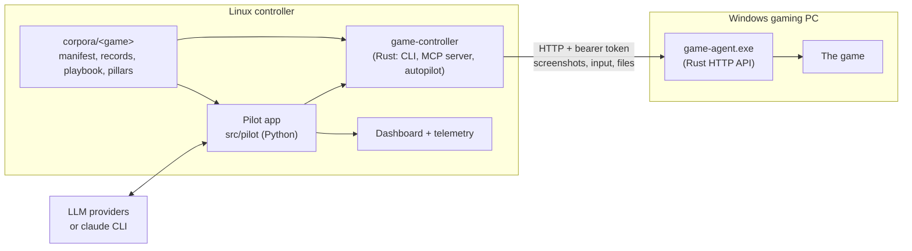

# Game Harness

Lets a language model play PC strategy games. A small agent on the Windows gaming PC exposes the
screen, mouse, keyboard and game files over HTTP; a controller on a Linux machine drives it, and a
pilot app puts any LLM (Gemini, Claude, GPT, local models) in charge, recording every decision on a
dashboard where you can watch, question and steer it.

Game knowledge lives in data files, not code: each game has a corpus of hotkeys, known screens,
records generated from the game's own files, a playbook and, for grand strategy, a set of strategy
pillars.

## How it works



The model plays each game the way that game allows:

| Game | How it is played | State |
|---|---|---|
| **Galactic Civilizations IV** | The controller ends turns itself (each one verified by the date changing) and clears known screens; the model decides only real choices (events, research, builds, policies, trades) from screenshots. | Played live |
| **Stellaris** | The game's own AI plays the empire; the model is a **governor** that picks one standing directive (expand, consolidate economy, tech rush, defend, …) from the monthly autosave, within a strategy of weighted pillars and milestones, and places tech picks and market trades. | Played live |
| **Civilization VI** | Planned: game state and orders through the game's Lua tuner. | Connectivity spike |

## Quick start

Requirements: Linux with Rust (stable) and Python 3.13; a Windows 10/11 PC on the same network
running the game in borderless or windowed mode.

```bash
python3 -m venv .venv && .venv/bin/pip install -e '.[dev]' pillow
cargo build --release -p game-controller
scripts/ci.sh                                   # prints "CI OK"
```

Install the agent on the PC: `scripts/serve-agent.sh [host]` builds it and prints a one-line
PowerShell command to run on the PC. With a host name the PC gets its own token
(`.agent_token.<host>`; set it as `GAME_AGENT_TOKEN` for that PC), otherwise the shared `.agent_token`
is used. The agent runs as the logged-in user (a logon task); only the firewall rule needs admin once.
Stop the server when the installer reports the agent version (it stops itself after 15 minutes).

```bash
echo 'GAME_AGENT_URL=http://<pc-address>:8765' >> .env   # the PC's agent; .env is gitignored
./target/release/game-controller health         # agent reachable?
./target/release/game-controller screenshot -o frame.jpg
.venv/bin/python -m pilot check --game stellaris
.venv/bin/python -m pilot run --game stellaris --months 12
.venv/bin/python -m pilot view                  # dashboard on port 8780
```

Model keys go in `.env` (`GEMINI_API_KEY`, `ANTHROPIC_API_KEY`, `OPENAI_API_KEY`), or use the
Claude Code CLI with a Claude subscription (no key). MCP clients (Claude Code, Gemini CLI) can use
the controller directly: `.mcp.json`, `.gemini/settings.json`.

## Documentation

| Read | For |
|---|---|
| [AGENTS.md](AGENTS.md) | The operating guide for any model working here: play loop, decisions, recoveries, how to record what it learns |
| [ARCHITECTURE.md](ARCHITECTURE.md) | Components, turn verification, known screens, coordinate scaling, agent API |
| [docs/pilot.md](docs/pilot.md) | The pilot app: models, the Stellaris governor, the strategy layer, dashboard, telemetry |
| [docs/cli.md](docs/cli.md) | Controller CLI and MCP tools |
| [docs/corpus.md](docs/corpus.md) | Game corpora, generated records, other screen sizes |
| [PLAYING.md](PLAYING.md) | Verified controls for Galactic Civilizations IV |
| [plan.md](plan.md), [issues.md](issues.md) | Feature status and known issues |

## Repository layout

```
crates/game-agent        Windows agent (HTTP API: screenshot, input, windows, files)
crates/game-controller   Linux controller (CLI, MCP server, autopilot, corpus, Stellaris saves)
src/pilot                Pilot app, governor, strategy layer, dashboard
corpora/<game>           Everything game-specific
scripts                  CI, agent installer server, extractors, play helpers
windows_agent            Installer (install.ps1)
deploy                   systemd user units
games                    Game journals
tests                    Python tests (Rust tests live in the crates)
```

`src/harness/` and `windows_agent/agent.py` are the first Python implementation, kept for its
tests; they are not deployed.

## Security

This is a tool for a home network, not the internet.

- The agent can see the PC's screen and send it any input, so it requires a bearer token (at least
  32 characters) on every request, and its firewall rule admits only the controller, on Private
  networks. Keep the `.agent_token*` files private (gitignored), give each PC its own token, and do
  not forward port 8765.
- Agent traffic, including the token, is plain HTTP. The installer server keeps its exposure short:
  files sit under a random one-time path, it binds only the controller's address and stops after 15
  minutes, and the one-liner pins the SHA-256 of `install.ps1` and of `game-agent.exe`.
- The agent reads only game folders listed in its `roots.json` and writes only allow-listed files
  (a Stellaris mod folder, Civilization VI's options file).
- The Civilization VI tuner relay (`/tuner/*`, agent 1.6.0) runs Lua inside the game, limited by the
  game's own Lua sandbox; it connects only to 127.0.0.1 and sits behind the same token.
- The dashboard can start runs and steer the game, so every request needs its access key. Open
  the link from `python -m pilot dashboard-link` (also printed in the viewer's log) once per
  browser; it sets an HttpOnly, SameSite=Lax cookie. The key is `PILOT_DASHBOARD_KEY` or
  `runs/dashboard.key` (generated once, mode 0600); rotate it by deleting that file and restarting
  both pilot services. Changes must be JSON from the dashboard's own origin. Details:
  [docs/pilot.md](docs/pilot.md#access-key).
- API keys belong in `.env` (gitignored); never commit `runs/`, `play/` or `incoming/`.

## Development

`scripts/ci.sh` runs the Rust build, tests, clippy, the Windows agent build check, corpus loading,
ruff and pytest. Commit with `scripts/ci-commit.sh "type(scope): summary" "body"`, which commits
and pushes only when CI passes; Python-only changes skip the Rust stages. Conventions are in
[AGENTS.md](AGENTS.md) §8–9.
